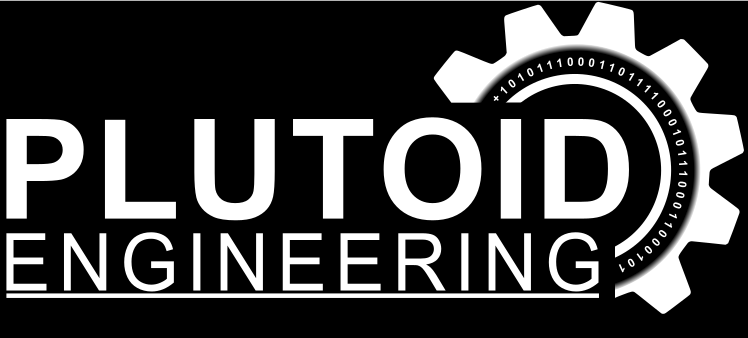

# BoatPerformanceLogger

Telemetry and instrumentation system for a Hydrolift T18 with a Yamaha Autolube D150H 65N 150 hp outboard. Built under the **Plutoid Engineering** brand.

The system reads sensors at the engine, streams live data to a helm display, and logs everything for later analysis — the goal being to work out which trim, jackplate height and propeller combination actually runs fastest.

## Architecture

The sensor node reads everything at the engine and streams it over Wi-Fi (UDP, JSON) to a Raspberry Pi at the helm. The Pi receives the stream, logs it, and serves a live dashboard to a 7" screen. Log files are synced to a homelab (InfluxDB + Grafana) when internet is available — typically by sharing a phone's mobile data at the dock.

```
┌─────────────┐   UDP / JSON    ┌──────────────────────────┐
│ Sensor node │ ──(Wi-Fi)─────► │ Raspberry Pi (Wi-Fi AP)  │
│  ESP32-S3   │   ~20 Hz        │                          │
│             │                 │  logger.py:              │
│ RPM         │                 │   • receive UDP          │
│ Encoder     │                 │   • log to file          │──► 7" HDMI dash
│ Alarms      │                 │   • serve dashboard      │
│ GPS/IMU/…   │                 │   • /status JSON API     │
└─────────────┘                 └───────────┬──────────────┘
                                            │ when internet is shared
                                            ▼
                                   ┌──────────────────┐
                                   │ Homelab          │
                                   │ InfluxDB+Grafana │
                                   └──────────────────┘
```

The Pi runs as a Wi-Fi access point that the sensor node connects to as a client. Three concerns are kept decoupled: receiving/logging always runs, the dashboard can restart without losing data, and homelab sync can fail for weeks without affecting either.

| Node | Board | Role |
|------|-------|------|
| **BoatPerformanceSensor** | ESP32-S3 | Reads all sensors at the engine, streams UDP/JSON to the Pi |
| **BoatPerformanceDash** | Raspberry Pi 4B | UDP receiver, logger, and web dashboard on a 7" HDMI screen |
| **BoatPerformanceDisplay** | ESP32-C6 | Round GC9A01A display — *superseded by the Pi dash, being removed* |

## Sensors

| Signal | Method | Status |
|--------|--------|--------|
| Jackplate height | Magnetic quadrature encoder (0.005 mm/pulse) | Done |
| Engine RPM | Tach pulse from rectifier → optocoupler → ESP32-S3 PCNT | In progress |
| Alarms | Original overheat / low-oil warnings read as active-low inputs | In progress |
| GPS speed / position | ATGM336H module | Planned |
| Trim angle | Resistive sender via ADC | Planned |
| Pitch / roll / G | BNO085 IMU (on-chip fusion) | Planned |
| Propeller slip | Calculated from RPM, gear ratio, prop pitch and GPS speed | Planned |
| Fuel flow | Flow sensor FS-40-10-AL(Pulse sensor) | Planned |
| Water pressure | Sensor | Planned |

## Data flow

The sensor node sends one JSON object per sample over UDP:

```json
{"ms":125340,"lift":96.4,"trim","rpm":3200,"overheat":0,"oilLow":0,"kn":0.0,"waterpressure":0.0,"fuel":0.0,}
```

Using JSON (rather than positional CSV) keeps the stream self-describing and name-based, so adding a sensor never breaks field ordering between the node and the Pi. `ms` is the ESP's `millis()` — used both for measuring intervals and for stale-link detection.

The dashboard polls `/status` and derives slip client-side from RPM and GPS speed. If the ESP's `ms` stops advancing (link lost) or the server stops responding, the dashboard shows a full-screen **NO LINK** warning — frozen numbers at 60 kn are more dangerous than a blank screen.

## Propeller slip

Slip is derived, not measured:

```
slip % = (1 − V_actual / V_theoretical) × 100
V_theoretical (kn) ≈ (RPM × pitch_in) / (gear_ratio × 1215)
```

`V_actual` comes from GPS. On the dashboard the slip is drawn as the gap between actual RPM and the RPM the boat *would* be turning at zero slip.

## Repository layout

```
BoatPerformanceLogger/
├── BoatPerformanceSensor/    # engine node (PlatformIO, ESP32-S3)
├── BoatPerformanceDash/      # Raspberry Pi: logger.py + web dashboard
├── BoatPerformanceDisplay/   # old ESP32-C6 display — being removed
├── BoatPerformanceLogger/    # Python part for Raspberry Pi
├── Docs/                     # images, notes, BOM etc.
├── .gitignore
└── README.md
```

## Hardware

- ESP32-S3-DevKitC-1 (N16R8) — sensor node
- Raspberry Pi 4B (8 GB) — dashboard + logger
- 7" HDMI IPS panel (sunlight-readable target ≥1000 nits)
- Magnetic encoder for jackplate position
- PC817 optocoupler + zener clamp for the tach signal
- ATGM336H GPS, BNO085 IMU *(planned)*
- GC9A01A 240×240 round TFT — *legacy display node, being removed*

## Build

The sensor node is built with [PlatformIO](https://platformio.org/) using the
[pioarduino](https://github.com/pioarduino/platform-espressif32) fork.

```bash
# from inside a node's project folder
pio run                 # build
pio run --target upload # flash
pio device monitor      # serial monitor
```

The Pi side runs `logger.py` (Python 3 + Flask). Flask is installed via apt on
Raspberry Pi OS:

```bash
sudo apt install python3-flask -y
python3 logger.py
```

## Rig constants

Several values must be set for your specific engine and prop before slip and RPM read correctly:

| Constant | Where | Note |
|----------|-------|------|
| `PULSES_PER_REV` | `rpm.h` | 6 for a 12-pole Yamaha V-block — verify against the factory tacho |
| `GEAR` | dashboard | Gearbox ratio, verify for the D150 |
| `PITCH_IN` | dashboard | Propeller pitch in inches |
| `REDLINE` | dashboard | Check the engine manual |

## License

TBD

---
<p align="left">
  
</p>